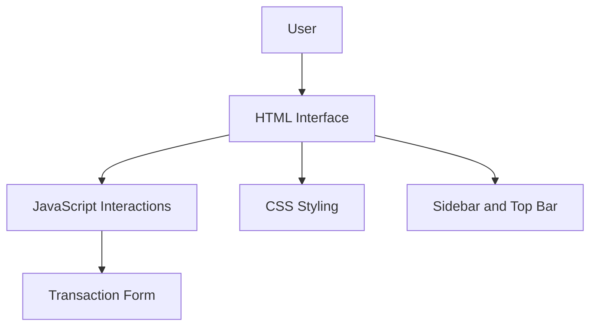
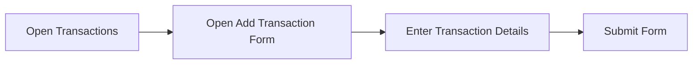

<div align="center">

# SmartBudget

**A personal finance web application for organizing and reviewing transactions.**


</div>

---

## Overview

SmartBudget is a frontend web application for managing transaction information. It provides a dashboard-style interface with a sidebar, a top bar, and a dedicated transactions page.

The project focuses on the structure and presentation of a personal finance application, including navigation, reusable page elements, and a form for entering transaction details.

## Features

- Dashboard-style layout
- Sidebar navigation
- Top bar for page-level controls
- Transactions page
- Form for adding transaction details
- Font Awesome icons

## Architecture

SmartBudget follows a **client-side frontend architecture**. The application is organized into three main layers:

| Layer | Responsibility |
|---|---|
| **Presentation** | HTML pages define the content and structure of the interface. |
| **Styling** | CSS controls layout, colors, spacing, and responsive behavior. |
| **Interaction** | JavaScript handles actions in the interface, including transaction form interactions. |

The sidebar and top bar provide consistent navigation around the application. Page-specific content, such as the transaction form, is displayed in the main content area.



## Application Structure

The code is organized by responsibility:

| Area | Purpose |
|---|---|
| **HTML pages** | Define the dashboard, transactions page, and other interface content. |
| **CSS stylesheets** | Control the appearance and layout of the pages. |
| **JavaScript files** | Add interaction to the interface and transaction form. |
| **Assets** | Store visual resources used by the application. |
| **Font Awesome** | Provides icons for navigation and interface elements. |

## Transaction Flow

The transaction page provides a form for entering transaction details. The flow begins when the user opens the transactions section and continues through the form.



## Technologies

- **HTML** — page structure
- **CSS** — layout and visual styling
- **JavaScript** — frontend interactions
- **Font Awesome** — interface icons

## Getting Started

### Requirements

A modern web browser, such as Google Chrome, Microsoft Edge, or Mozilla Firefox.

### Run locally

```bash
git clone https://github.com/cristina1200/SmartBudgetApp.git
cd SmartBudgetApp
```

Open the main HTML file in your browser. During development, you can open the project in Visual Studio Code and use the **Live Server** extension.

## Possible Improvements

- Edit and delete transactions
- Filter transactions by date, type, or category
- Add income and expense summaries
- Display spending charts
- Connect the interface to a backend or database

## Author

**Cristina Fatan**  
[GitHub Profile](https://github.com/cristina1200)
